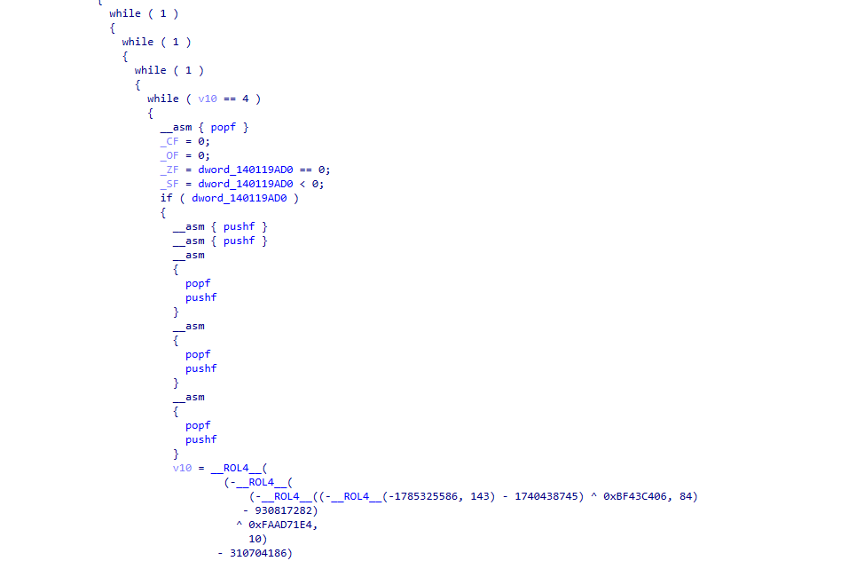
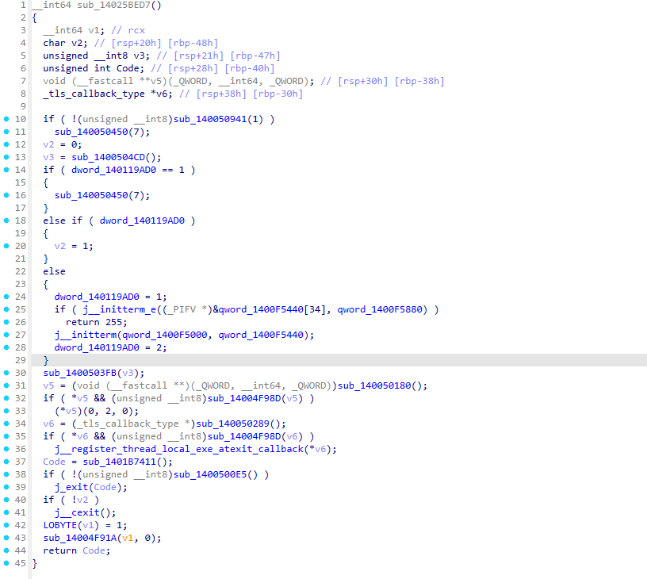

# de-Alcatraz

>*"On the night of June 11, 1962, inmates Frank Morris and brothers John and Clarence Anglin escaped from Alcatraz Federal Penitentiary, the maximum-security prison on Alcatraz Island in San Francisco Bay, California, United States."* - Wikipedia

**de-Alcatraz** is a static deobfuscator designed to break the protections applied by the [Alcatraz](https://github.com/weak1337/Alcatraz) framework for obfuscating x64 PE binaries.

## Features
- Removal of junk instructions:
    - Removes anti-disassembly patterns (e.g., `jmp` + 1 byte inside instruction).
    - Removes stack noise (`pushf` / `popf` sequences).

- Simplification of immediate calculation chains.
- Optimization for tail calls:
    - Resolves obfuscated function calls that use intermediate *thunk* jumps.

- Resolution for Control Flow Flattening (CFF).
- Or, as simple as: **The opposite of what Alcatraz does**.

## Installation

Clone the repository:
```bash
git clone [https://github.com/fazect/de-Alcatraz.git](https://github.com/fazect/de-Alcatraz.git)
cd de-Alcatraz
```

Install dependencies:
```bash
pip install -r requirements.txt
```

## Usage
```
deobfuscator.py [-h] -i INPUT [-o OUTPUT] [-s SECTION] [-v]
```

For instance, `deobfuscator.py -i input.exe -o output.exe -s .text -v`.

## Methodology

The tool runs in **4** separate steps:

1. `remove_garbages()`: Scans for `\xEB\xFF` (`jmp` + 1) instructions and replaces the first byte with `nop`. Removes `pushf` / `popf` pairs.

2. `simplify_arithmetic_op()`: Searches for immediate calculation chains and collapses each of them into a single instruction with the final immediate.

3. `merge_tail_calls()`: For each call instruction, skips the *thunk* jumps in between and patches to call the final destination directly.

4. `solve_cff()`: For each CFF group, finds the main dispatcher, and redirects all paths to directly jump to destination instead of going through the dispatcher.

## Preview

Before deobfuscation:



After deobfuscation:

